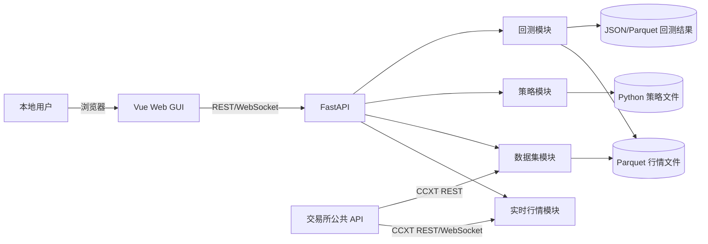
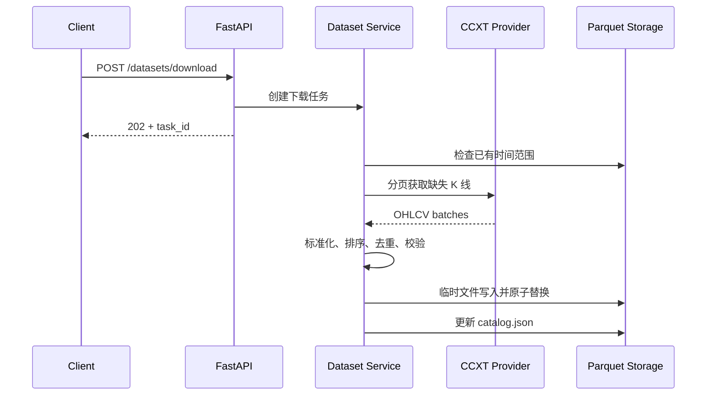

# CoinFighter FastAPI 架构设计方案

> 文档版本：v0.1  
> 项目阶段：本地行情研究与策略回测  
> 数据存储：本地文件  
> 更新时间：2026-09-06

## 1. 背景

CoinFighter 当前是一个最小 FastAPI 示例项目，只包含基础启动文件和两个演示接口。本阶段将其建设为面向个人量化研究的本地服务，提供以下能力：

1. 从 CCXT 支持的交易所获取公开市场数据。
2. 查询最新行情，并通过 WebSocket 向本地客户端推送行情。
3. 将历史 K 线保存为本地 Parquet 数据集。
4. 加载和校验用户编写的 Python 策略。
5. 使用本地历史数据运行回测。
6. 保存回测参数、状态、交易记录、净值曲线和指标报告。
7. 通过本地 Web GUI 完成看盘、数据下载、策略编辑和回测分析。

当前阶段不连接用户交易账户，不执行真实下单。

## 2. 设计目标

### 2.1 功能目标

- 支持多个行情提供方，第一阶段实现 Binance 公共行情。
- 对外暴露统一的行情数据结构，隔离不同交易所之间的字段差异。
- 支持按交易所、市场、交易对、周期和时间范围下载数据。
- 支持增量更新、重复数据清理和基础质量检查。
- 提供稳定、简单、可测试的策略接口。
- 支持多个回测任务，但限制本机并发数量。
- 应用重启后仍能查询已经完成的回测结果。
- 提供一个无需单独安装桌面客户端的浏览器 GUI。

### 2.2 工程目标

- API、业务逻辑和外部系统实现保持分离。
- 核心回测代码不依赖 FastAPI，能够独立测试和运行。
- 行情提供方和存储格式可以替换，不影响上层业务接口。
- 本地文件结构稳定，可被 Pandas、Polars 等工具直接读取。
- 为后续接入数据库、任务队列和实盘交易保留扩展边界。

### 2.3 非目标

当前版本明确不实现：

- 用户注册、登录和权限管理。
- 云端多租户部署。
- PostgreSQL、Redis、消息队列。
- 交易所 API Key 管理。
- 实盘或模拟盘订单执行。
- 真实账户余额、订单和持仓同步。
- 分布式回测集群。
- 高频 Tick 级撮合。

## 3. 架构原则

### 3.1 模块化单体

项目作为一个代码仓库和一个 FastAPI 服务部署，但代码按照行情、数据集、策略和回测四个领域拆分。当前阶段不提前拆成微服务。

### 3.2 FastAPI 只作为交互入口

FastAPI 负责：

- HTTP 和 WebSocket 协议处理。
- 请求参数校验。
- 调用业务服务。
- 返回统一响应和错误。
- 管理应用级资源的启动与关闭。

FastAPI 路由不直接实现下载循环、指标计算和回测算法。

### 3.3 I/O 异步，计算隔离

- CCXT 网络访问使用异步接口。
- 长时间数据下载由应用内任务管理器调度。
- CPU 密集型回测在独立子进程中运行。
- FastAPI 事件循环不直接执行完整回测。

### 3.4 本地文件是当前事实来源

- 历史行情使用 Parquet。
- 元数据、任务状态和汇总指标使用 JSON。
- 策略使用 Python 文件，可配套 YAML 参数文件。
- 日志使用文本或 JSON Lines。
- 写文件采用“临时文件 + 原子替换”，避免留下半写文件。

## 4. 系统上下文



## 5. 运行时组件

### 5.1 Web GUI

GUI 使用 Vue 3、TypeScript 和 Vite 构建成单页应用，主要职责：

- 展示实时价格、K 线和市场状态。
- 选择数据源、交易对、周期和时间范围并创建下载任务。
- 展示下载进度、数据覆盖范围和质量检查结果。
- 在浏览器中创建、编辑和校验本地策略。
- 配置并启动回测，展示任务进度、净值、回撤、成交和指标。

GUI 不直接访问交易所或本地文件，所有数据都通过 FastAPI 的 REST API 和 WebSocket 获取。

开发环境中，Vite 开发服务器运行在独立端口并将 `/api` 和 `/ws` 代理到 FastAPI。发布时执行前端构建，将 `frontend/dist` 作为静态文件交给 FastAPI 提供，因此用户只需访问一个本地地址。

### 5.2 FastAPI 主进程

主要职责：

- 暴露 REST API 和 WebSocket。
- 维护公共 HTTP/CCXT 客户端。
- 维护实时行情订阅。
- 管理数据下载任务。
- 提交、查询和取消回测任务。
- 扫描本地数据集和策略目录。

本地文件存储阶段建议只启动一个 Uvicorn Worker。多 Worker 会造成重复行情订阅以及多个进程同时写同一文件的问题。

### 5.3 回测子进程

每个回测任务由受控的进程池执行，主要职责：

- 加载指定 Parquet 数据。
- 加载策略和参数。
- 执行逐根 K 线回放。
- 模拟委托、成交、手续费和滑点。
- 定期写入任务进度。
- 输出交易记录、净值曲线和统计指标。

回测进程不启动 Web 服务，也不直接修改其他回测任务的目录。

### 5.4 行情连接管理器

主要职责：

- 按需建立交易所行情连接。
- 合并相同交易对和周期的订阅。
- 维护断线重连和心跳。
- 将交易所数据标准化。
- 向本地 WebSocket 客户端广播数据。

实时行情默认只保存在内存中。只有用户发起历史数据下载或明确开启采集时才写入本地文件。

## 6. 推荐目录

```text
CoinFighterFastAPI/
├── pyproject.toml
├── .env.example
├── README.md
├── main.py
├── docs/
│   └── architecture.md
├── frontend/
│   ├── package.json
│   ├── vite.config.ts
│   ├── index.html
│   ├── public/
│   └── src/
│       ├── main.ts
│       ├── App.vue
│       ├── api/
│       │   ├── client.ts
│       │   ├── market.ts
│       │   ├── datasets.ts
│       │   ├── strategies.ts
│       │   └── backtests.ts
│       ├── router/
│       │   └── index.ts
│       ├── stores/
│       │   ├── market.ts
│       │   ├── tasks.ts
│       │   └── settings.ts
│       ├── views/
│       │   ├── MarketView.vue
│       │   ├── DatasetsView.vue
│       │   ├── StrategiesView.vue
│       │   └── BacktestsView.vue
│       ├── components/
│       │   ├── layout/
│       │   ├── market/
│       │   ├── datasets/
│       │   ├── strategies/
│       │   └── backtests/
│       ├── composables/
│       │   ├── useMarketSocket.ts
│       │   └── useTaskPolling.ts
│       ├── types/
│       │   └── api.ts
│       └── styles/
│           └── main.css
├── app/
│   ├── __init__.py
│   ├── main.py
│   ├── api/
│   │   ├── __init__.py
│   │   ├── router.py
│   │   └── v1/
│   │       ├── __init__.py
│   │       ├── market.py
│   │       ├── datasets.py
│   │       ├── strategies.py
│   │       └── backtests.py
│   ├── core/
│   │   ├── __init__.py
│   │   ├── config.py
│   │   ├── exceptions.py
│   │   ├── logging.py
│   │   └── lifespan.py
│   ├── modules/
│   │   ├── market/
│   │   │   ├── schemas.py
│   │   │   ├── service.py
│   │   │   ├── normalizer.py
│   │   │   └── subscriptions.py
│   │   ├── datasets/
│   │   │   ├── schemas.py
│   │   │   ├── service.py
│   │   │   ├── downloader.py
│   │   │   ├── validator.py
│   │   │   └── catalog.py
│   │   ├── strategies/
│   │   │   ├── base.py
│   │   │   ├── schemas.py
│   │   │   ├── loader.py
│   │   │   ├── validator.py
│   │   │   └── indicators.py
│   │   └── backtest/
│   │       ├── schemas.py
│   │       ├── engine.py
│   │       ├── broker.py
│   │       ├── portfolio.py
│   │       ├── metrics.py
│   │       ├── runner.py
│   │       └── reports.py
│   └── infrastructure/
│       ├── providers/
│       │   ├── base.py
│       │   └── ccxt_provider.py
│       ├── storage/
│       │   ├── paths.py
│       │   ├── parquet.py
│       │   ├── json_store.py
│       │   └── locks.py
│       └── runtime/
│           ├── process_pool.py
│           └── task_registry.py
├── strategies/
│   ├── examples/
│   │   ├── buy_and_hold.py
│   │   └── moving_average.py
│   └── user/
├── local_data/
│   ├── market/
│   ├── catalog/
│   ├── cache/
│   └── backtests/
└── tests/
    ├── unit/
    ├── integration/
    └── fixtures/
```

### 6.1 GUI 目录职责

`frontend/src/views` 对应四个主要工作页面：

- `MarketView.vue`：交易对选择、实时行情卡片、K 线图、成交量和连接状态。
- `DatasetsView.vue`：历史数据下载表单、本地数据集列表、覆盖区间、下载进度和质量报告。
- `StrategiesView.vue`：策略列表、Python 代码编辑器、参数说明、保存与校验结果。
- `BacktestsView.vue`：回测配置、任务状态、收益指标、净值/回撤图和成交明细。

`frontend/src/api` 封装所有后端调用，Vue 组件不得散落硬编码 URL。`frontend/src/stores` 保存跨页面状态，`composables` 封装 WebSocket 重连和任务轮询等行为，`components` 保存可复用界面组件。

第一版图表统一使用一个支持 K 线、折线和柱状图的浏览器图表库，例如 Apache ECharts，避免同时维护多套图表适配代码。策略编辑器第一版可以使用普通代码文本编辑组件；需要补全、语法高亮和错误标记时再接入 Monaco Editor。

### 6.2 GUI 页面结构

```text
┌───────────────────────────────────────────────────────────┐
│ CoinFighter                         API状态 / 行情连接状态 │
├──────────────┬────────────────────────────────────────────┤
│ 实时看盘     │                                            │
│ 数据管理     │              当前功能页面                  │
│ 策略编辑     │                                            │
│ 回测分析     │                                            │
├──────────────┴────────────────────────────────────────────┤
│ 后台任务进度 / 最近错误 / 本地数据目录状态                │
└───────────────────────────────────────────────────────────┘
```

GUI 使用桌面优先布局，同时保证普通平板宽度可用。当前阶段不单独开发 Electron、原生桌面端或移动端。

### 6.3 前后端运行方式

开发环境：

```text
浏览器 -> http://127.0.0.1:5173  Vite
                       |
                       +-- /api、/ws 代理到 127.0.0.1:8000
```

发布环境：

```text
浏览器 -> http://127.0.0.1:8000
                       ├── /api/v1/*  FastAPI API
                       ├── /api/v1/market/ws  WebSocket
                       └── /*  frontend/dist 静态文件及 SPA fallback
```

这种方式保留前后端独立开发体验，同时让最终本地用户只启动一个服务、打开一个地址。

## 7. 分层职责

### 7.1 API 层

`app/api` 只处理协议转换：

1. 将 HTTP 请求转换为 Pydantic 请求对象。
2. 调用对应模块的 Service。
3. 将领域结果转换为响应对象。
4. 将应用异常转换为统一错误响应。

API 层不得直接依赖 CCXT，不得直接读写 Parquet，也不得实现策略或回测逻辑。

### 7.2 业务模块层

`app/modules` 保存可复用的业务规则：

- `market`：行情查询、标准化和订阅管理。
- `datasets`：数据下载、增量合并、质量检查和数据集目录。
- `strategies`：策略协议、加载、参数校验和指标。
- `backtest`：事件回放、模拟成交、账户状态和指标计算。

业务模块可以通过抽象接口读取行情或文件，但不关心 CCXT、PyArrow 的具体初始化方式。

### 7.3 基础设施层

`app/infrastructure` 提供具体技术实现：

- `providers`：CCXT 和模拟行情源。
- `storage`：Parquet、JSON、路径和文件锁。
- `runtime`：进程池和本地任务注册表。

依赖方向保持为：

```text
API -> Modules -> Infrastructure interfaces
                    ^
                    |
              Concrete adapters
```

## 8. 核心模块设计

### 8.1 行情模块

统一行情结构至少包括：

```text
Candle
├── provider
├── market_type
├── symbol
├── timeframe
├── timestamp
├── open
├── high
├── low
├── close
├── volume
└── is_closed
```

内部时间统一使用带 UTC 时区的时间对象；与 CCXT 交互时使用 UTC 毫秒时间戳。

交易对在项目内部统一使用 `BASE/QUOTE` 格式，例如 `BTC/USDT`。文件路径中使用安全名称 `BTCUSDT` 或编码后的市场标识。

### 8.2 数据集模块

数据下载流程：



下载器必须处理：

- 交易所单次请求数量限制。
- CCXT 和交易所限速。
- `since` 分页游标推进。
- 空结果和重复时间戳。
- 网络错误重试与最大重试次数。
- 当前尚未收盘 K 线。
- 交易所没有成交造成的合法时间缺口。
- 用户主动取消任务。

### 8.3 策略模块

第一版策略采用受约束的 Python 接口：

```python
class Strategy:
    name: str

    def initialize(self, context) -> None:
        """在回测开始前调用一次。"""

    def on_bar(self, context, bar) -> None:
        """每根已完成 K 线调用一次。"""

    def finalize(self, context) -> None:
        """在回测结束后调用一次。"""
```

策略通过 `context` 读取历史窗口、账户状态和策略参数，并通过以下方法产生模拟委托：

```python
context.buy(quantity=...)
context.sell(quantity=...)
context.close_position()
```

策略不直接修改 Portfolio，不直接写回测结果文件，也不能调用真实交易接口。

用户策略是可执行 Python 代码，应当视为本机可信代码。子进程隔离和超时只能降低故障影响，不构成完整安全沙箱。

### 8.4 回测模块

第一版使用逐根 K 线事件驱动模型：

```text
读取下一根 K 线
    -> 更新当前市场状态
    -> 处理上一阶段待成交委托
    -> 更新账户和持仓
    -> 调用 Strategy.on_bar
    -> 接收新的模拟委托
    -> 记录资产净值
```

默认撮合规则：

- 策略只能看到当前及以前的数据，禁止未来数据泄漏。
- 当前 K 线生成的市价委托默认在下一根 K 线开盘价成交。
- 成交价叠加配置的滑点。
- 每笔成交按成交额计算手续费。
- 第一版支持现货、单交易对和单向持仓。
- 限价单、做空、杠杆和多资产组合在后续版本实现。

核心统计指标：

- 总收益率。
- 年化收益率。
- 最大回撤。
- 夏普比率。
- 胜率。
- 盈亏比。
- 交易次数。
- 总手续费。
- 净值曲线。

## 9. 本地存储设计

### 9.1 行情数据

目录规则：

```text
local_data/market/{provider}/{market_type}/{symbol}/{timeframe}/{year}-{month}.parquet
```

示例：

```text
local_data/market/binance/spot/BTCUSDT/1m/2026-09.parquet
```

Parquet Schema：

| 字段 | 建议类型 | 说明 |
| --- | --- | --- |
| timestamp | timestamp(ms, UTC) | K 线开始时间 |
| open | float64 | 开盘价 |
| high | float64 | 最高价 |
| low | float64 | 最低价 |
| close | float64 | 收盘价 |
| volume | float64 | 基础币成交量 |
| is_closed | boolean | K 线是否已经结束 |

`provider`、`market_type`、`symbol` 和 `timeframe` 由目录表达，也可以同时写入 Parquet 元数据。

文件内部要求：

- 按 `timestamp` 升序排列。
- `timestamp` 唯一。
- 使用 UTC。
- 默认使用 Zstandard 压缩。
- 每个自然月一个文件。

### 9.2 数据集目录

`local_data/catalog/datasets.json` 保存可快速扫描的索引：

```json
{
  "datasets": [
    {
      "dataset_id": "binance_spot_btcusdt_1m",
      "provider": "binance",
      "market_type": "spot",
      "symbol": "BTC/USDT",
      "timeframe": "1m",
      "start": "2026-01-01T00:00:00Z",
      "end": "2026-09-05T23:59:00Z",
      "rows": 357120,
      "updated_at": "2026-09-06T08:00:00Z"
    }
  ]
}
```

Catalog 是可重建的缓存。如果索引损坏，应能通过扫描 Parquet 文件重新生成。

### 9.3 回测结果

每次回测使用独立目录：

```text
local_data/backtests/{run_id}/
├── request.json
├── status.json
├── metrics.json
├── trades.parquet
├── equity.parquet
└── error.log
```

文件职责：

- `request.json`：不可变的回测参数快照。
- `status.json`：任务状态、进度、开始和结束时间。
- `metrics.json`：回测汇总指标。
- `trades.parquet`：模拟成交明细。
- `equity.parquet`：逐时点资产净值。
- `error.log`：失败时保存的错误摘要。

任务状态：

```text
PENDING -> RUNNING -> COMPLETED
                   -> FAILED
                   -> CANCELED
```

### 9.4 原子写入和并发控制

本地写入流程：

1. 获取目标文件锁。
2. 写入同目录临时文件。
3. 重新读取并执行基本校验。
4. 原子重命名为正式文件。
5. 更新 Catalog 或任务状态。
6. 释放文件锁。

同一个数据分区同一时间只允许一个写任务。不同交易对或月份可以并行下载。

## 10. API 初稿

统一前缀：`/api/v1`

### 10.1 系统接口

| 方法 | 路径 | 说明 |
| --- | --- | --- |
| GET | `/health/live` | 进程是否存活 |
| GET | `/health/ready` | 本地目录和行情提供方是否可用 |

### 10.2 行情接口

| 方法 | 路径 | 说明 |
| --- | --- | --- |
| GET | `/market/providers` | 可用行情提供方 |
| GET | `/market/symbols` | 获取交易对列表 |
| GET | `/market/ticker/{symbol}` | 获取最新行情 |
| GET | `/market/candles/{symbol}` | 查询近期 K 线 |
| WS | `/market/ws` | 订阅实时行情 |

### 10.3 数据集接口

| 方法 | 路径 | 说明 |
| --- | --- | --- |
| GET | `/datasets` | 查询本地数据集 |
| GET | `/datasets/{dataset_id}` | 查询数据集详情 |
| POST | `/datasets/download` | 创建下载任务 |
| GET | `/datasets/tasks/{task_id}` | 查询下载进度 |
| POST | `/datasets/{dataset_id}/validate` | 校验数据集 |

### 10.4 策略接口

| 方法 | 路径 | 说明 |
| --- | --- | --- |
| GET | `/strategies` | 扫描并列出策略 |
| GET | `/strategies/{name}` | 获取策略元数据 |
| POST | `/strategies` | 创建本地策略文件 |
| GET | `/strategies/{name}/source` | 读取策略源码 |
| PUT | `/strategies/{name}/source` | 原子保存策略源码 |
| POST | `/strategies/{name}/validate` | 验证策略 |
| POST | `/strategies/reload` | 重新加载策略目录 |

策略文件接口只允许访问配置的 `strategies/user` 目录，必须拒绝绝对路径、`..` 和符号链接越界。保存后先进行语法检查；语法无效时保留编辑内容并返回明确诊断，但不得加载执行。

### 10.5 回测接口

| 方法 | 路径 | 说明 |
| --- | --- | --- |
| POST | `/backtests` | 提交回测 |
| GET | `/backtests` | 查询回测记录 |
| GET | `/backtests/{run_id}` | 查询状态与汇总 |
| POST | `/backtests/{run_id}/cancel` | 取消回测 |
| GET | `/backtests/{run_id}/trades` | 查询成交明细 |
| GET | `/backtests/{run_id}/equity` | 查询净值曲线 |

长时间下载和回测接口返回 `202 Accepted` 和任务 ID，不保持 HTTP 请求直到任务结束。

## 11. 配置设计

配置通过环境变量和 `.env` 读取：

```dotenv
APP_NAME=CoinFighter
APP_ENV=development
HOST=127.0.0.1
PORT=8000
API_PREFIX=/api/v1

DEFAULT_PROVIDER=binance
DEFAULT_MARKET_TYPE=spot
CCXT_ENABLE_RATE_LIMIT=true
HTTP_TIMEOUT_SECONDS=30

LOCAL_DATA_DIR=./local_data
STRATEGY_DIR=./strategies/user
PARQUET_COMPRESSION=zstd

MAX_DOWNLOAD_TASKS=2
MAX_BACKTEST_PROCESSES=2
BACKTEST_TIMEOUT_SECONDS=3600
LOG_LEVEL=INFO
```

默认只绑定 `127.0.0.1`。如果未来监听非本机地址，需要增加认证、跨域限制和策略代码访问控制。

## 12. 错误响应

所有 API 使用统一错误结构：

```json
{
  "code": "DATASET_VALIDATION_FAILED",
  "message": "数据集存在重复时间戳",
  "details": {
    "duplicate_count": 12
  },
  "request_id": "01J..."
}
```

错误码分类：

- `PROVIDER_*`：行情提供方或网络错误。
- `DATASET_*`：本地数据集错误。
- `STRATEGY_*`：策略加载和运行错误。
- `BACKTEST_*`：回测配置或执行错误。
- `SYSTEM_*`：路径、权限和内部错误。

## 13. 可观测性

第一阶段不引入独立监控平台，但保留结构化日志：

```text
timestamp
level
request_id
task_id
run_id
provider
symbol
event
duration_ms
message
```

关键日志事件：

- API 请求开始和结束。
- CCXT 请求失败与重试。
- 下载任务开始、分页进度和完成。
- 数据质量检查结果。
- 策略加载错误。
- 回测开始、进度、完成和异常。

日志中不得记录未来可能加入的 API Key 等敏感信息。

## 14. 测试策略

### 14.1 单元测试

覆盖纯业务规则：

- 行情标准化。
- K 线排序、去重和缺口检测。
- 策略接口校验。
- 模拟成交价格。
- 手续费和滑点。
- 持仓均价和收益。
- 最大回撤等指标。
- 防止未来数据泄漏。

### 14.2 集成测试

覆盖模块之间的协作：

- CCXT Provider 下载到 Parquet。
- 增量下载与月度文件合并。
- FastAPI 接口提交下载任务。
- FastAPI 接口提交并查询回测。
- 应用重启后扫描历史任务。

### 14.3 固定测试数据

`tests/fixtures` 保存规模很小且结果确定的 K 线数据。回测测试不得依赖实时交易所网络，以保证结果可重复。

### 14.4 GUI 测试

- 使用 Vitest 测试 API 封装、状态管理和关键组件。
- 测试 WebSocket 断线重连与任务轮询清理。
- 使用浏览器端到端测试覆盖“下载数据 -> 编辑策略 -> 启动回测 -> 查看结果”主流程。
- 前端 CI 同时执行 TypeScript 类型检查和生产构建。

## 15. 建议实施阶段

### 阶段一：项目骨架

- 建立 `pyproject.toml` 和目录结构。
- 使用应用工厂和 lifespan。
- 实现配置、日志、异常和健康检查。
- 建立单元测试基础。

验收标准：服务可以启动，健康检查和自动化测试通过。

### 阶段二：行情与本地数据

- 定义 Provider 抽象。
- 实现 CCXT Provider。
- 实现 OHLCV 分页下载。
- 实现 Parquet 分区、Catalog 和质量检查。
- 实现数据集 API。

验收标准：可以下载指定时间范围的 BTC/USDT K 线，重启后仍能发现数据集，重复下载只补齐缺失区间。

### 阶段三：策略框架

- 定义 Strategy 和 Context。
- 实现策略加载、校验和参数模型。
- 添加 Buy And Hold 与均线策略示例。

验收标准：错误策略能返回清晰诊断，示例策略可以在固定 K 线上产生确定信号。

### 阶段四：回测引擎

- 实现 Engine、Broker、Portfolio 和 Metrics。
- 实现进程池与任务状态持久化。
- 实现回测 API 和结果文件。

验收标准：回测不阻塞健康检查和行情查询，相同输入能够得到一致结果。

### 阶段五：GUI 与实时看盘

- 实现行情订阅管理器。
- 接入实时行情源。
- 实现客户端 WebSocket 广播。
- 增加断线重连和订阅恢复。
- 建立 Vue 3 + TypeScript + Vite 前端。
- 实现看盘、数据管理、策略编辑和回测分析页面。
- 将生产构建静态文件挂载到 FastAPI。

验收标准：用户启动一个本地服务即可打开 GUI；能够在界面中完成数据下载、策略保存校验、回测启动和结果查看；短暂断网恢复后行情可以继续推送。

## 16. 后续演进

满足以下条件后再考虑数据库或分布式组件：

- Catalog 和任务查询规模导致目录扫描明显变慢。
- 多个用户或多个服务进程需要并发写入。
- 需要跨机器管理下载和回测任务。
- 需要复杂条件查询大量回测结果。
- 需要实盘订单、资金、审计和事务一致性。

演进顺序建议：

1. 首先用 SQLite 或 DuckDB 增强本地元数据查询，但行情文件仍使用 Parquet。
2. 多用户部署时迁移到 PostgreSQL。
3. 多进程任务调度时引入 Redis 和任务队列。
4. 实盘交易单独增加订单、仓位、风控和交易所账户模块。

## 17. 第一版技术决策摘要

| 决策 | 选择 | 原因 |
| --- | --- | --- |
| 应用形态 | 模块化单体 | 当前规模下简单、易调试 |
| Web 框架 | FastAPI | 异步接口、类型校验、OpenAPI |
| GUI | Vue 3 + TypeScript + Vite | 轻量 SPA，适合本地工具和实时交互 |
| 图表 | Apache ECharts | 同时覆盖 K 线、成交量、净值和回撤 |
| 行情访问 | CCXT 异步接口 | 统一多个交易所公开接口 |
| 行情存储 | Parquet + Zstandard | 列式、压缩高效、适合回测 |
| 元数据存储 | JSON | 无需数据库，便于检查和重建 |
| 策略形式 | Python 类 | 开发灵活，适合本地研究 |
| 回测执行 | 受控子进程池 | 隔离 CPU 任务，避免阻塞 API |
| Web Worker 数 | 1 | 避免本地文件写入和订阅冲突 |
| 首期市场 | 现货、单交易对 | 控制撮合和账户模型复杂度 |

## 18. 当前实现状态

本设计已在 CoinFighterFastAPI v0.1 中落地。实现状态和旧版 CoinFighter 的迁移映射见
[`docs/migration.md`](migration.md)。第一版实时行情推送采用“CCXT 公共 REST 轮询 +
FastAPI WebSocket 广播”，没有依赖 CCXT Pro；该实现保持 Provider 边界，后续可替换为
交易所原生 WebSocket。
